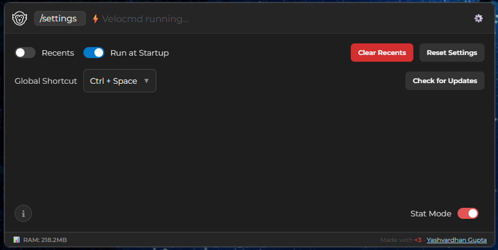
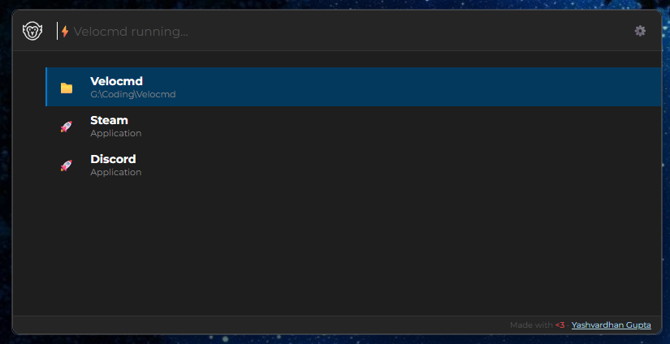

# Feature Deep Dive

Velocmd is packed with power-user features that go far beyond a simple search bar. Below is a detailed guide on every feature available to accelerate your workflow.

{ width="750" }

---

## Smart Chips & Advanced Filtering

When querying thousands of files, you need precision. Velocmd uses a "Smart Chip" system to filter your search context instantly. 

Type either `/` or `@` followed by a filter keyword. Press <kbd>Space</kbd> to lock the chip in place, then type your search query. You can chain multiple chips together (e.g., `/C: /folders work`).

### Exhaustive Filter List

Velocmd supports multiple aliases for the same filter, allowing you to type whatever feels most natural.

| Primary Chip | Supported Aliases | What it does | Example |
| ------------ | ----------------- | ------------ | ------- |
| `/apps` | `/app`, `/application`, `/exe`, `/lnk` | Restricts search to executable apps | `/apps discord` |
| `/folders` | `/folder`, `/dir`, `/directory` | Restricts search to directories | `/dir projects` |
| `/files` | `/file` | Restricts search to standard files | `/files budget` |
| `/drives` | `/drive`, `/disk` | Filters for top-level mounted drives | `/disk` |
| `/settings` | `/setting`, `/config`, `/setup` | Searches Windows system settings | `/settings display` |
| `/velo` | `@velo` | Exclusively shows internal Velocmd commands | `/velo recents` |

{ width="750" }

**Drive Targeting:**
Velocmd detects all your active drives. Filter directly by typing the letter (e.g., `/C:`, `/D:`, `/Z:`).

**File Extension Filtering:**
You can filter by *any* specific file extension natively by typing `/` followed by the extension (e.g., `/pdf`, `/png`, `/rs`, `/js`).

!!! tip "Keyboard Shortcut"
    If you type a chip (like `/apps`) and it is highlighted as the first result, pressing <kbd>Enter</kbd> will automatically convert it into a Smart Chip and clear the text box for your actual query!

---

## Active Window & Tab Management

Velocmd isn't just for launching new programs; it is a powerful window switcher. 

Instead of using <kbd>Alt</kbd> + <kbd>Tab</kbd> to cycle through dozens of open windows, simply type `/tabs` or `/active` to search through your currently running applications. Hit <kbd>Enter</kbd> to instantly bring that window to the foreground—even if it is currently minimized.

Velocmd natively categorizes and identifies specific windows for:

* **Browsers:** Chrome, Edge, Brave, and Firefox Tabs.
* **Development:** VS Code instances.
* **Communication:** Discord and WhatsApp.

---

## Instant Terminal Execution (`cmd`)

You no longer need to open the Windows Run prompt (`Win+R`) or manually launch `cmd.exe`. Simply type `!cmd` or `/cmd` (or `@cmd`), enter your terminal command, and press <kbd>Enter</kbd>.

{ width="750" }

!!! example "Usage Examples"
    * `!cmd ping google.com` – Spawns a terminal and pings the server.
    * `!cmd ipconfig /flushdns` – Instantly flushes your DNS cache.
    * `!cmd code .` – Opens VS Code in your current directory.

---

## Intelligent Web & Question Routing

Velocmd acts as a bridge to your default web browser, allowing you to bypass the address bar entirely.

### Supported Search Engines
Force a search query to a specific engine using these chips:

| Chip | Engine |
|------|--------|
| `/google` | Google Search |
| `/duck` or `/duckduckgo` | DuckDuckGo |
| `/bing` | Microsoft Bing |
| `/search` | Default System Search Engine |

Additionally, you can type `/web` to get a list of common websites to open in your default browser or you can type out a link to open as well.

### Private Web Browsing (Beta)
Triggered by typing the `/p` chip into the search bar supports: Incognito Web Browsing (Opens in default browser). This `/p` chip can also be added after a `/search` or `/web` tag to search that query or open that link in your default browser in incognito mode.

Anything searched on Private Mode (`/p`) will by default not be saved in the recents.

!!! example "Usage Examples"
    * `/search /p google.com` – Searches Google in incognito mode.
    * `/web /p youtube.com` – Opens YouTube in incognito mode.
    * `/p` – Lists all the common websites to open in incognito mode.

### Natural Language Detection
Velocmd automatically detects if you are asking a question. If your query starts with any of the following words, it will automatically suggest a Web Search as the top result:
**how**, **what**, **why**, **when**, or **who**.

---

## Deep System & Control Panel Integration

Velocmd hardcodes 32 deeply buried Windows settings and legacy tools into its in-memory index. Simply search for what you want to change, and Velocmd will route you directly to the native module.

### Available System Commands

| Category | Available Commands |
| -------- | ------------------ |
| **System Settings** | Display Settings, Sound Settings, Bluetooth & other devices, Wi-Fi Settings, Personalization, Taskbar Settings, Date & Time Settings, Power & Sleep Settings, Storage Settings, Background Apps, Notifications & actions, Default Apps. |
| **App Management** | Startup Apps, Uninstall Program, Apps & Features, Installed Apps, Windows Update. |
| **Legacy OS Tools** | Control Panel, Task Manager, Command Prompt, PowerShell, Registry Editor, Environment Variables, System Properties, Network Connections, Disk Management, Device Manager, Services, Group Policy Editor, Resource Monitor, Event Viewer, System Information. |

---

## Keeping Your Index Updated

Because Velocmd runs entirely in memory to maintain its lightning speed, it needs to periodically sync with your hard drive to learn about new files.

* **Automatic Refresh:** Velocmd silently rescans your drives and updates its index in the background every **15 minutes**.
* **Manual Refresh:** If you just installed a new application or downloaded a file and need it to appear immediately, you can force a resync. Simply type `/velo` and select **Velo: Refresh Index** (or just search `Refresh`), then hit <kbd>Enter</kbd>.

---

## Internal Velocmd Commands

You can control Velocmd's behavior directly from the search bar. Typing `/velo` (or `@velo`) will reveal the following internal commands:

| Command Name | Action |
| ------------ | ------ |
| **Velo: Help** | Opens the Velocmd documentation site. |
| **Velo Settings** | Opens the inline configuration panel. |
| **Velo: Toggle Recents** | Turns the intelligent "Recent Files" view on or off. |
| **Velo: Clear Recents** | Wipes your local history from the interface immediately. |
| **Velo: Refresh Index** | Forces an immediate rescan of all drives. |
| **Velo: Quit** | Quits Velocmd. |
| **Velo: Close Window** | Closes the active window. |
| **Active Tabs** | Lists all currently open applications and windows. |
| **Show Desktop** | Minimizes all windows to instantly reveal your desktop (equivalent to `Win+D`). |
| **Shutdown / Restart** | Prompts a confirmation before executing a system power action. |
| **Media: Play/Pause** | Toggles media playback via the Windows API. |
| **Media: Next / Previous Track** | Skips to the next or previous track. |

{ width="750" }

---

## System Hub   

Typing `/pc` or `/thispc` or `/computer` gives a list of all the common Windows default folders/locations.

* **Desktop**
* **Downloads**
* **Documents**
* **Pictures**
* **Videos**
* **Music**
* **This PC**
* **Recycle Bin**

---

## Power & Media Controls

Control your environment without leaving your keyboard.

### Media Playback
Search for these commands to control your background music/video natively via the Windows API:

* `Media: Play/Pause`
* `Media: Next Track`
* `Media: Previous Track`

### Safe Power States
Type `Shutdown` or `Restart`. Velocmd provides a built-in safety net: when you hit Enter, it will ask:

* `✅ Yes, I am sure`
* `❌ No, Cancel`

---

## System Tray Background Process

Velocmd runs silently in the background to ensure instantaneous response times. You will find the Velocmd monkey icon sitting in your Windows System Tray (bottom right corner).

* **Left-Click:** Instantly shows or hides the command palette.
* **Right-Click:** Opens the context menu to quit the application entirely.

---

## The Velocmd Settings Panel

Press <kbd>Tab</kbd> while the launcher is open to flip down the inline Settings panel. This panel interacts directly with Velocmd's local configuration (`settings.json` in your AppData) to securely persist your preferences between reboots.

{ width="750" }

### Interface Sizing & Minimalist Mode
By default, Velocmd doesn't display recently accessed items below the search bar. However, you can control the launcher's physical footprint directly from the settings:

* **Toggle Recents:** Turning this on instantly expands Velocmd from its standard compact view into a recents-pane search bar. Perfect for accessing recents on-the-go.

{ width="750" }

### Customizing the Global Shortcut
By default, Velocmd opens with <kbd>Win</kbd> + <kbd>Shift</kbd> + <kbd>.</kbd> (Win+Shift+Period). In the settings panel, you can click the shortcut display to open a dropdown of alternatives. 

**Live Availability Checking:**
Velocmd doesn't just let you pick a broken shortcut. Behind the scenes, it pings the Windows API in real-time to verify if a hotkey is actually available on your machine before letting you assign it.

**Supported Preset Shortcuts:**

| Shortcuts |
|----------|
| `Win + Shift + .` *(Default)* |
| `Alt + Space` |
| `Win + Space` |
| `Ctrl + Space` |
| `Ctrl + Shift + Space` |
| `Win + S` |
| `Alt + S` |
| `Win + /` |

!!! note "Automatic Fallback Logic"
    If another app updates and steals your preferred shortcut (or the default) while Velocmd is closed, you won't be locked out. Upon startup, Velocmd automatically iterates through its preset list and silently registers the first available fallback hotkey.

### Autostart Management
Toggle "Start with Windows" directly from the panel. This registers Velocmd with the native Windows startup agent, ensuring your lightning-fast, in-memory index is already built and waiting the exact second you log into your PC.

### Check for Updates
Velocmd automatically checks for updates on startup - with an added button to `check for updates` manually from the settings panel.

### Real-Time Analytics (Stat Mode)
Toggle the new **Stat Mode** to display a live footprint footer across your launcher. It displays Velocmd's real-time physical memory (RAM) allocation underneath the search bar to help you monitor performance at a glance.

!!! tip "Stat Mode"
    **Stat Mode** is a lightweight, opt-in feature that displays Velocmd's current physical memory (RAM) usage in the footer of the launcher. Go to settings, click on "Stat Mode" and toggle it on to see it in action.