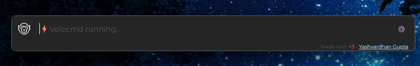
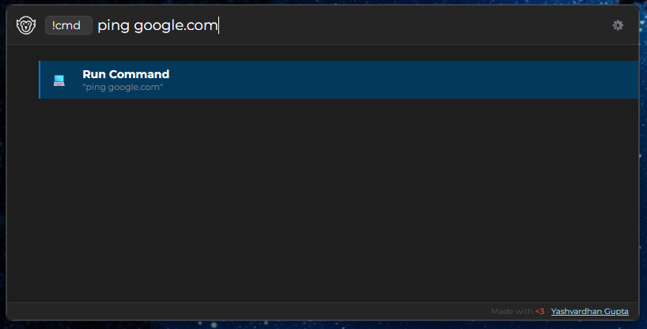
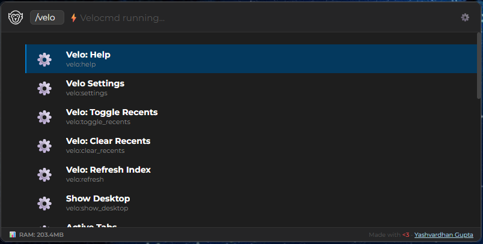

# How to Use

Velocmd is built around speed and keyboard-first navigation. Once the app is running in your system tray, you rarely need to touch your mouse.

---

## The Master Shortcut

To summon the Velocmd palette from anywhere in Windows, use the global shortcut:

> <kbd>Win</kbd> + <kbd>Shift</kbd> + <kbd>.</kbd>

If this shortcut conflicts with another app, you can easily change it. Simply hit <kbd>Tab</kbd> to open the settings panel and select a new preset (like <kbd>Alt</kbd> + <kbd>Space</kbd> or <kbd>Ctrl</kbd> + <kbd>Space</kbd>).

{ width="750" }

!!! note "Fallback Shortcuts"
    If your chosen shortcut (or the default) is already in use by another application, Velocmd will automatically fallback and assign the next available hotkey from its preset list, ensuring you can always access the launcher.

---

## Basic Navigation

Once the command palette is open, just start typing. Velocmd instantly searches your apps, files, and folders.

* **<kbd>↓</kbd> / <kbd>↑</kbd>** : Navigate through search results.
* **<kbd>Enter</kbd>** : Open the selected file, folder, or application.
* **<kbd>Esc</kbd>** : Clear the search bar. Pressing it a second time hides the launcher.
* **<kbd>Tab</kbd>** : Toggle the Settings menu.

!!! tip "Click Away" 
    Velocmd is built to stay out of your way. Clicking anywhere outside the search bar will instantly hide it and return focus to your previous app.

---

## Smart Tag Filtering (Chips)

To narrow down thousands of files instantly, type an `/` or `@` followed by a category. This converts your query into a **Smart Chip**, filtering the results underneath.

| Tag | What it searches | Example |
|---|---|---|
| `/apps` | Only executable applications | `/apps` discord |
| `/folders` | Only directories | `/folders` downloads |
| `/files` | Only documents and standalone files | `/files` budget.xlsx |
| `/C:` | Only items located on your C: drive | `/C:` system32 |
| `/settings` | Only Windows System Settings | `/settings` shutdown |
| `/tabs` | Currently open windows and browser tabs | `/tabs` github |

{ width="750" }

!!! tip "Chaining Tags"
    You can stack tags for precision. Typing "`/D: /folders` work" will instantly show you all folders named "work" specifically on your D: drive.

!!! tip "Fast Chip Autocomplete"
    If you type the start of a chip (like `/ap`) and the `/apps` tag is highlighted as the first result, pressing <kbd>Enter</kbd> will automatically lock it in as a Smart Chip and clear the text box for your actual query!

---

## Terminal & Web Commands

Velocmd routes specific tags to external tools, allowing you to bypass your browser's address bar or the Windows Run prompt entirely.

### Quick Terminal
Use the `!cmd` tag to instantly pass a command to the Windows command prompt.
* *Example:* Type `!cmd ping google.com` and hit Enter. A terminal window will pop up executing the ping.

{ width="750" }

### Quick Web Search
Skip opening a new tab. Use these tags to push your search query directly to your default browser:

| | | |
|---|---|---|
| `/google [query]` | `/duck [query]`| `/bing [query]` |

---

## Keeping Your Index Updated

Because Velocmd runs entirely in memory to maintain its blazing speed, it needs to periodically sync with your hard drive to learn about new files.

* **Automatic Refresh:** Velocmd silently rescans your drives and updates its index in the background every **15 minutes**.
* **Manual Refresh:** If you just installed a new application or downloaded a file and need it to appear immediately, you can force a resync. Simply type `/velo` and select **Velo: Refresh Index** (or just search `Refresh`), then hit <kbd>Enter</kbd>.

---

## Built-in System Controls

Velocmd integrates directly with Windows, giving you instant access to system-level actions without lifting your hands from the keyboard. Simply type these commands into the bar:

* `Shutdown` : Prompts a fast system shutdown.
* `Restart` : Prompts a fast system reboot.
* `Show Desktop` : Instantly minimizes all open windows (like Win+D).
* `Media: Play/Pause` : Toggles your current media player.
* `Media: Next Track` : Skips to the next song.

{ width="750" }

